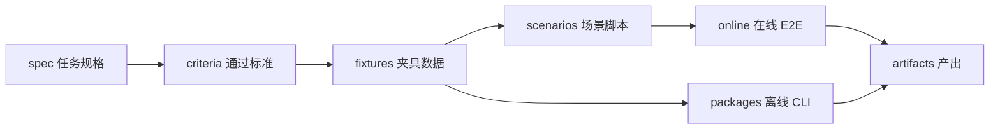

# Agent-Evaluation

周报 Agent 质检框架。按**职责分目录**，英文命名，文件不重叠。

## 目录一览

| 目录 | 含义 | 放什么 |
|------|------|--------|
| `spec/` | 任务规格 Task Spec | OpenSpec、设计文档 |
| `criteria/` | 通过标准 Pass Criteria | 评分标准文档（仅文档） |
| `fixtures/` | 测试夹具 Test Fixtures | **纯数据**：用例 JSON、CSV/XLSX 语料 |
| `scenarios/` | 场景构建 Scenario Builders | **造数脚本** generate_*.py |
| `online/` | 在线评测 Online E2E | 执行、打分、发布、同步、定时（一条链路） |
| `packages/` | 离线 CLI Offline CLI | 完整 `weekly_report_quality` Python 包 |
| `artifacts/` | 产出归档 Artifacts | run 归档、reviews、摘要 |
| `tests/` | 单元测试 | 离线包测试 |

## 架构关系



## 快速开始

```bash
# 在线 E2E
cd online
python run_report_agent_cases.py --env test --suite agent --no-webhook

# 离线 CLI
PYTHONPATH=packages python3 -m weekly_report_quality lint --cases fixtures/offline/cases
PYTHONPATH=packages python3 -m weekly_report_quality run \
  --cases fixtures/offline/cases \
  --evidence fixtures/offline/evidence \
  --out artifacts/offline-runs
```

## 依赖

```bash
pip install -r requirements.txt
```
